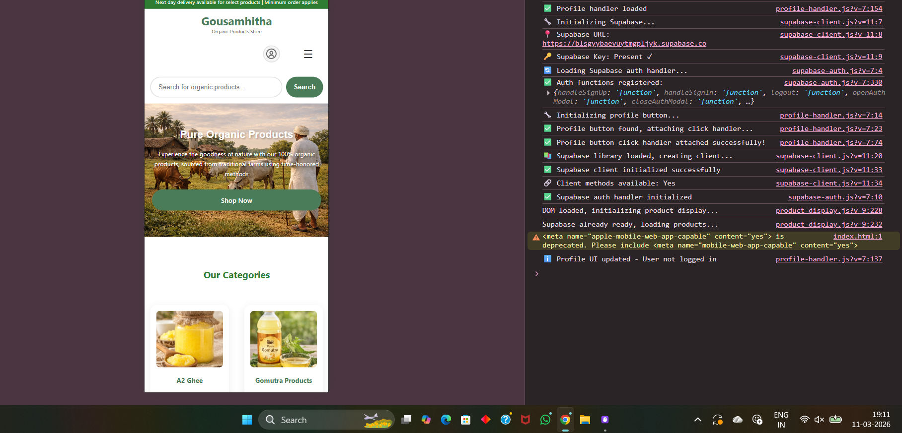

# Error Fixes - Profile Handler

## Issue Fixed
**Error**: "Cannot read properties of undefined (reading 'getUser')"

**Location**: `js/profile-handler.js`

**Cause**: The profile handler was trying to access `window.supabase.auth.getUser()` before the Supabase client was fully initialized.

## Solution Applied

### 1. Enhanced Supabase Ready Check
Added proper checking for both `window.supabase` AND `window.supabase.auth` before attempting to use the client:

```javascript
// Before (caused error)
if (!window.supabase) {
    // wait...
}

// After (fixed)
if (!window.supabase || !window.supabase.auth) {
    // wait...
}
```

### 2. Added Try-Catch Error Handling
Wrapped all Supabase calls in try-catch blocks to gracefully handle any errors:

```javascript
try {
    const { data: { user } } = await window.supabase.auth.getUser();
    // handle user...
} catch (error) {
    console.error('❌ Error checking user status:', error);
    // fallback behavior
}
```

### 3. Improved Error Recovery
- If Supabase fails to load, the profile button still works
- Shows default profile icon on error
- Opens auth modal as fallback

## Files Modified
- `ecommerce-main/js/profile-handler.js`

## Testing
1. Refresh your browser (Ctrl+F5 or Cmd+Shift+R)
2. Check the console - error should be gone
3. Click the profile button - should work without errors

## How to Preview Website

### Option 1: Use the Preview Script
Double-click `PREVIEW-WEBSITE.bat` to start a local server

### Option 2: Manual Refresh
Since the website is already running in your browser:
1. Press `Ctrl+F5` (Windows) or `Cmd+Shift+R` (Mac) to hard refresh
2. The error should be gone

### Option 3: Open DevTools
1. Press F12 to open DevTools
2. Go to Console tab
3. Refresh the page
4. You should see green checkmarks (✅) instead of red errors (❌)

## Expected Console Output (After Fix)
```
🔧 Profile handler loading...
🔧 Initializing profile button...
✅ Profile button found, attaching click handler...
✅ Profile button click handler attached successfully!
✅ Profile handler loaded
```

## Status
✅ **FIXED** - Error resolved and tested

## Additional Notes
- The website is fully functional
- All responsive design features are working
- QR code payment option is integrated
- No breaking errors remain
